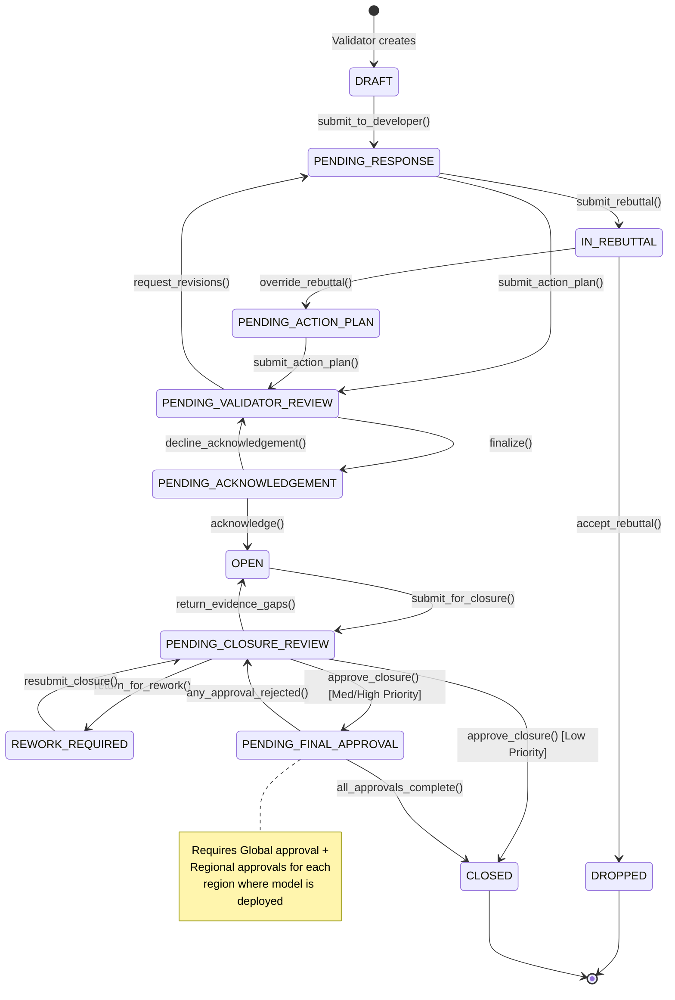

# Model Recommendations (Issues) Feature Design Document

## 1. Executive Summary

This document defines the architecture for the **Model Recommendations** feature, which tracks weaknesses/issues identified during model validation, manages the negotiation of remediation plans between Validators and Developers, and governs the formal closure process.

**Business Term**: Recommendation = A specific issue or weakness identified by a Validator during validation or ongoing monitoring.

---

## 2. Business Context & Terminology

| Term | Definition |
|------|------------|
| **Recommendation** | A specific issue/weakness identified by a Validator, requiring remediation by the Model Development team |
| **Action Plan** | The set of tasks a Developer commits to perform to remediate a Recommendation |
| **Action Plan Task** | An individual remediation task with owner, description, and target date |
| **Rebuttal** | A Developer's formal argument that the Recommendation is invalid, with supporting rationale/evidence |
| **Closure Evidence** | Documentation/artifacts demonstrating that remediation is complete |
| **Priority** | Severity classification (High/Medium/Low) with configurable approval requirements for closure |

### 2.1 Key Actors

| Role | Responsibilities |
|------|-----------------|
| **Validator** | Creates recommendations, reviews rebuttals/action plans, reviews closure evidence |
| **Model Developer/Owner** | Responds to recommendations (rebuttal or action plan), executes remediation, submits closure evidence |
| **Global Approver** | Final approval authority for Medium/High priority recommendation closures (Global level) |
| **Regional Approver** | Final approval for recommendations affecting models deployed in their authorized regions |
| **Admin** | Full system access, can act on behalf of any role |

---

## 3. State Machine

### 3.1 Complete Lifecycle States

```
┌─────────────────────────────────────────────────────────────────────────────────────────────┐
│                          RECOMMENDATION LIFECYCLE STATE MACHINE                              │
└─────────────────────────────────────────────────────────────────────────────────────────────┘

                                     ┌──────────┐
                                     │  DRAFT   │ ◄── Validator creates
                                     └────┬─────┘
                                          │ submit_to_developer()
                                          ▼
                               ┌─────────────────────┐
                               │  PENDING_RESPONSE   │ ◄── Awaiting developer action
                               └──────────┬──────────┘
                                          │
                    ┌─────────────────────┴─────────────────────┐
                    │ submit_rebuttal()                         │ submit_action_plan()
                    ▼                                           ▼
           ┌──────────────┐                          ┌───────────────────────────┐
           │  IN_REBUTTAL │                          │  PENDING_VALIDATOR_REVIEW │
           └───────┬──────┘                          └─────────────┬─────────────┘
                   │                                               │
      ┌────────────┴────────────┐                    ┌─────────────┴─────────────┐
      │ accept_rebuttal()       │ override_rebuttal()│ request_revisions()       │ finalize()
      ▼                         ▼                    ▼                           ▼
┌───────────┐        ┌─────────────────────┐  (loop back to              ┌───────────────────────┐
│  DROPPED  │        │ PENDING_ACTION_PLAN │   PENDING_RESPONSE)         │ PENDING_ACKNOWLEDGEMENT│
└───────────┘        └──────────┬──────────┘                             └───────────────┬───────┘
   (CLOSED)                     │                                                        │
                                │ submit_action_plan()                     ┌─────────────┴──────────────┐
                                ▼                                          │ decline_acknowledgement()  │ acknowledge()
                     ┌───────────────────────────┐                         ▼                            ▼
                     │  PENDING_VALIDATOR_REVIEW │ ◄───────────────────────┘                     ┌────────┐
                     └───────────────────────────┘                                               │  OPEN  │
                                                                                                 └───┬────┘
                                                                                                     │ submit_for_closure()
                                                                                                     ▼
                                                                                       ┌─────────────────────────┐
                                                                                       │ PENDING_CLOSURE_REVIEW  │
                                                                                       └────────────┬────────────┘
                                                                              ┌────────────────────┬┴───────────────────┐
                                                                              │ return_for_rework()│ approve_closure()  │
                                                                              ▼                    │                    │
                                                                   ┌─────────────────┐             │                    │
                                                                   │ REWORK_REQUIRED │─────────────┘                    │
                                                                   └────────┬────────┘ submit_for_closure()             │
                                                                            │                                           │
                                                                            └───────────────────────────────────────────┘
                                                                                                   │
                                                                              ┌────────────────────┼────────────────────┐
                                                                              │ (Low Priority)     │ (Med/High Priority)│
                                                                              ▼                    ▼                    │
                                                                       ┌──────────┐   ┌─────────────────────────┐      │
                                                                       │  CLOSED  │   │ PENDING_FINAL_APPROVAL  │      │
                                                                       └──────────┘   └───────────┬─────────────┘      │
                                                                                                  │                    │
                                                                      (Global + Regional approvals required)           │
                                                                              ┌───────────────────┴──────────────────┐ │
                                                                              │ any reject()      all approve()      │ │
                                                                              ▼                             ▼        │ │
                                                                   ┌─────────────────────────┐       ┌──────────┐   │ │
                                                                   │  PENDING_CLOSURE_REVIEW │◄──────│  CLOSED  │   │ │
                                                                   └─────────────────────────┘       └──────────┘   │ │
                                                                   (with rejection_reason)                          │ │
                                                                                                                    │ │
```

### 3.2 State Definitions

| Status Code | Display Name | Description |
|-------------|--------------|-------------|
| `DRAFT` | Draft | Validator is composing the recommendation (not yet visible to developer) |
| `PENDING_RESPONSE` | Pending Response | Issued to developer; awaiting rebuttal or action plan submission |
| `IN_REBUTTAL` | In Rebuttal | Developer has submitted a rebuttal; awaiting validator review |
| `DROPPED` | Dropped | Validator accepted rebuttal; recommendation invalidated (terminal state) |
| `PENDING_ACTION_PLAN` | Pending Action Plan | Rebuttal was overridden; developer must submit an action plan |
| `PENDING_VALIDATOR_REVIEW` | Pending Validator Review | Action plan submitted; awaiting validator review |
| `PENDING_ACKNOWLEDGEMENT` | Pending Acknowledgement | Validator finalized recommendation & action plan; awaiting developer sign-off |
| `OPEN` | Open | Acknowledged; remediation in progress |
| `PENDING_CLOSURE_REVIEW` | Pending Closure Review | Developer submitted closure evidence; awaiting validator review |
| `REWORK_REQUIRED` | Rework Required | Validator returned closure for additional work |
| `PENDING_FINAL_APPROVAL` | Pending Final Approval | Validator approved closure (Med/High priority); awaiting Global + Regional approvals |
| `CLOSED` | Closed | Remediation verified and approved (terminal state) |

### 3.3 Valid State Transitions

```
DRAFT                     → PENDING_RESPONSE
PENDING_RESPONSE          → IN_REBUTTAL, PENDING_VALIDATOR_REVIEW
IN_REBUTTAL               → DROPPED, PENDING_ACTION_PLAN
PENDING_ACTION_PLAN       → PENDING_VALIDATOR_REVIEW
PENDING_VALIDATOR_REVIEW  → PENDING_RESPONSE, PENDING_ACKNOWLEDGEMENT
PENDING_ACKNOWLEDGEMENT   → PENDING_VALIDATOR_REVIEW, OPEN
OPEN                      → PENDING_CLOSURE_REVIEW
PENDING_CLOSURE_REVIEW    → OPEN, REWORK_REQUIRED, PENDING_FINAL_APPROVAL, CLOSED
REWORK_REQUIRED           → PENDING_CLOSURE_REVIEW
PENDING_FINAL_APPROVAL    → PENDING_CLOSURE_REVIEW, CLOSED
DROPPED                   → (terminal)
CLOSED                    → (terminal)
```

---

## 4. Database Schema

### 4.1 Entity Relationship Diagram (Mermaid)

```mermaid
erDiagram
    Recommendation ||--o{ ActionPlanTask : "has many"
    Recommendation ||--o{ RecommendationRebuttal : "has many"
    Recommendation ||--o{ ClosureEvidence : "has many"
    Recommendation ||--o{ RecommendationStatusHistory : "has many"
    Recommendation ||--o{ RecommendationApproval : "has many"
    Recommendation }o--|| Model : "belongs to"
    Recommendation }o--|| ValidationRequest : "optionally linked to"
    Recommendation }o--|| User : "created by (validator)"
    Recommendation }o--|| User : "assigned to (developer)"
    Recommendation }o--|| TaxonomyValue : "priority"
    Recommendation }o--|| TaxonomyValue : "category"
    Recommendation }o--|| TaxonomyValue : "current status"

    ActionPlanTask }o--|| User : "owner"
    ActionPlanTask }o--|| TaxonomyValue : "completion status"

    RecommendationRebuttal }o--|| User : "submitted by"
    RecommendationRebuttal }o--|| User : "reviewed by"

    ClosureEvidence }o--|| User : "uploaded by"

    RecommendationStatusHistory }o--|| User : "changed by"
    RecommendationStatusHistory }o--|| TaxonomyValue : "old status"
    RecommendationStatusHistory }o--|| TaxonomyValue : "new status"

    RecommendationApproval }o--|| User : "approver"
    RecommendationApproval }o--o| Region : "region (for Regional type)"
    RecommendationApproval }o--o| User : "voided by"

    RecommendationPriorityConfig ||--|| TaxonomyValue : "priority"

    RecommendationPriorityConfig {
        int config_id PK
        int priority_id FK UK "High/Medium/Low"
        bool requires_final_approval "configurable by admin"
        text description "nullable"
        datetime created_at
        datetime updated_at
    }

    Recommendation {
        int recommendation_id PK
        int model_id FK
        int validation_request_id FK "nullable"
        string recommendation_code UK "auto-generated"
        string title
        text description
        text root_cause_analysis
        int priority_id FK "High/Medium/Low"
        int category_id FK "taxonomy"
        int current_status_id FK
        int created_by_id FK "Validator"
        int assigned_to_id FK "Developer/Owner"
        date original_target_date
        date current_target_date
        date closed_at "nullable"
        int closed_by_id FK "nullable"
        text closure_summary "nullable"
        datetime created_at
        datetime updated_at
    }

    ActionPlanTask {
        int task_id PK
        int recommendation_id FK
        int task_order
        text description
        int owner_id FK
        date target_date
        date completed_date "nullable"
        int completion_status_id FK
        text completion_notes "nullable"
        datetime created_at
        datetime updated_at
    }

    RecommendationRebuttal {
        int rebuttal_id PK
        int recommendation_id FK
        int submitted_by_id FK
        text rationale
        text supporting_evidence
        datetime submitted_at
        int reviewed_by_id FK "nullable"
        datetime reviewed_at "nullable"
        string review_decision "nullable: ACCEPT/OVERRIDE"
        text review_comments "nullable"
        bool is_current "latest rebuttal"
    }

    ClosureEvidence {
        int evidence_id PK
        int recommendation_id FK
        string file_name
        string file_path "or URL"
        text description
        int uploaded_by_id FK
        datetime uploaded_at
    }

    RecommendationStatusHistory {
        int history_id PK
        int recommendation_id FK
        int old_status_id FK "nullable"
        int new_status_id FK
        int changed_by_id FK
        datetime changed_at
        text change_reason "nullable"
        text additional_context "JSON for action details"
    }

    RecommendationApproval {
        int approval_id PK
        int recommendation_id FK
        string approval_type "GLOBAL/REGIONAL"
        int region_id FK "nullable - for Regional type"
        int represented_region_id FK "nullable - historical context"
        int approver_id FK "nullable until approved"
        datetime approved_at "nullable"
        bool is_required
        string approval_status "PENDING/APPROVED/REJECTED/VOIDED"
        text comments "nullable"
        text approval_evidence "nullable - required for Admin proxy"
        int voided_by_id FK "nullable"
        text void_reason "nullable"
        datetime voided_at "nullable"
        datetime created_at
    }
```

### 4.2 SQLAlchemy Models

#### 4.2.1 Recommendation (Core Entity)

```python
# api/app/models/recommendation.py

class Recommendation(Base):
    """
    Core recommendation entity tracking issues identified during validation.
    Supports full lifecycle from draft through closure with action plan tracking.
    """
    __tablename__ = "recommendations"

    recommendation_id: Mapped[int] = mapped_column(Integer, primary_key=True)

    # Auto-generated code (e.g., "REC-2025-00001")
    recommendation_code: Mapped[str] = mapped_column(
        String(20), nullable=False, unique=True, index=True
    )

    # Core identification
    model_id: Mapped[int] = mapped_column(
        Integer, ForeignKey("models.model_id", ondelete="CASCADE"),
        nullable=False, index=True
    )
    validation_request_id: Mapped[Optional[int]] = mapped_column(
        Integer, ForeignKey("validation_requests.request_id", ondelete="SET NULL"),
        nullable=True, index=True,
        comment="Link to originating validation (if applicable)"
    )

    # Content
    title: Mapped[str] = mapped_column(String(500), nullable=False)
    description: Mapped[str] = mapped_column(Text, nullable=False)
    root_cause_analysis: Mapped[Optional[str]] = mapped_column(Text, nullable=True)

    # Classification
    priority_id: Mapped[int] = mapped_column(
        Integer, ForeignKey("taxonomy_values.value_id"), nullable=False,
        comment="High/Medium/Low - determines closure approval requirements"
    )
    category_id: Mapped[Optional[int]] = mapped_column(
        Integer, ForeignKey("taxonomy_values.value_id"), nullable=True,
        comment="e.g., Data Quality, Methodology, Implementation, Documentation"
    )

    # Workflow status
    current_status_id: Mapped[int] = mapped_column(
        Integer, ForeignKey("taxonomy_values.value_id"), nullable=False
    )

    # Actors
    created_by_id: Mapped[int] = mapped_column(
        Integer, ForeignKey("users.user_id"), nullable=False,
        comment="Validator who identified the issue"
    )
    assigned_to_id: Mapped[int] = mapped_column(
        Integer, ForeignKey("users.user_id"), nullable=False,
        comment="Developer/Owner responsible for remediation"
    )

    # Target dates
    original_target_date: Mapped[date] = mapped_column(Date, nullable=False)
    current_target_date: Mapped[date] = mapped_column(Date, nullable=False)

    # Closure fields
    closed_at: Mapped[Optional[datetime]] = mapped_column(DateTime, nullable=True)
    closed_by_id: Mapped[Optional[int]] = mapped_column(
        Integer, ForeignKey("users.user_id", ondelete="SET NULL"), nullable=True
    )
    closure_summary: Mapped[Optional[str]] = mapped_column(Text, nullable=True)

    # Finalization tracking
    finalized_at: Mapped[Optional[datetime]] = mapped_column(DateTime, nullable=True)
    finalized_by_id: Mapped[Optional[int]] = mapped_column(
        Integer, ForeignKey("users.user_id", ondelete="SET NULL"), nullable=True
    )
    acknowledged_at: Mapped[Optional[datetime]] = mapped_column(DateTime, nullable=True)
    acknowledged_by_id: Mapped[Optional[int]] = mapped_column(
        Integer, ForeignKey("users.user_id", ondelete="SET NULL"), nullable=True
    )

    # Timestamps
    created_at: Mapped[datetime] = mapped_column(DateTime, nullable=False, default=utc_now)
    updated_at: Mapped[datetime] = mapped_column(
        DateTime, nullable=False, default=utc_now, onupdate=utc_now
    )

    # Relationships
    model = relationship("Model", back_populates="recommendations")
    validation_request = relationship("ValidationRequest")
    priority = relationship("TaxonomyValue", foreign_keys=[priority_id])
    category = relationship("TaxonomyValue", foreign_keys=[category_id])
    current_status = relationship("TaxonomyValue", foreign_keys=[current_status_id])
    created_by = relationship("User", foreign_keys=[created_by_id])
    assigned_to = relationship("User", foreign_keys=[assigned_to_id])
    closed_by = relationship("User", foreign_keys=[closed_by_id])
    finalized_by = relationship("User", foreign_keys=[finalized_by_id])
    acknowledged_by = relationship("User", foreign_keys=[acknowledged_by_id])

    # One-to-many
    action_plan_tasks: Mapped[List["ActionPlanTask"]] = relationship(
        back_populates="recommendation", cascade="all, delete-orphan",
        order_by="ActionPlanTask.task_order"
    )
    rebuttals: Mapped[List["RecommendationRebuttal"]] = relationship(
        back_populates="recommendation", cascade="all, delete-orphan",
        order_by="desc(RecommendationRebuttal.submitted_at)"
    )
    closure_evidence: Mapped[List["ClosureEvidence"]] = relationship(
        back_populates="recommendation", cascade="all, delete-orphan"
    )
    status_history: Mapped[List["RecommendationStatusHistory"]] = relationship(
        back_populates="recommendation", cascade="all, delete-orphan",
        order_by="desc(RecommendationStatusHistory.changed_at)"
    )
    approvals: Mapped[List["RecommendationApproval"]] = relationship(
        back_populates="recommendation", cascade="all, delete-orphan"
    )
```

#### 4.2.2 ActionPlanTask

```python
class ActionPlanTask(Base):
    """Individual remediation task within an action plan."""
    __tablename__ = "action_plan_tasks"

    task_id: Mapped[int] = mapped_column(Integer, primary_key=True)
    recommendation_id: Mapped[int] = mapped_column(
        Integer, ForeignKey("recommendations.recommendation_id", ondelete="CASCADE"),
        nullable=False, index=True
    )
    task_order: Mapped[int] = mapped_column(Integer, nullable=False, default=1)
    description: Mapped[str] = mapped_column(Text, nullable=False)
    owner_id: Mapped[int] = mapped_column(
        Integer, ForeignKey("users.user_id"), nullable=False
    )
    target_date: Mapped[date] = mapped_column(Date, nullable=False)
    completed_date: Mapped[Optional[date]] = mapped_column(Date, nullable=True)
    completion_status_id: Mapped[int] = mapped_column(
        Integer, ForeignKey("taxonomy_values.value_id"), nullable=False,
        comment="NOT_STARTED, IN_PROGRESS, COMPLETED"
    )
    completion_notes: Mapped[Optional[str]] = mapped_column(Text, nullable=True)

    created_at: Mapped[datetime] = mapped_column(DateTime, nullable=False, default=utc_now)
    updated_at: Mapped[datetime] = mapped_column(
        DateTime, nullable=False, default=utc_now, onupdate=utc_now
    )

    # Relationships
    recommendation = relationship("Recommendation", back_populates="action_plan_tasks")
    owner = relationship("User", foreign_keys=[owner_id])
    completion_status = relationship("TaxonomyValue", foreign_keys=[completion_status_id])

    __table_args__ = (
        UniqueConstraint('recommendation_id', 'task_order', name='uq_rec_task_order'),
    )
```

#### 4.2.3 RecommendationRebuttal

```python
class RecommendationRebuttal(Base):
    """Tracks rebuttal submissions and their review outcomes."""
    __tablename__ = "recommendation_rebuttals"

    rebuttal_id: Mapped[int] = mapped_column(Integer, primary_key=True)
    recommendation_id: Mapped[int] = mapped_column(
        Integer, ForeignKey("recommendations.recommendation_id", ondelete="CASCADE"),
        nullable=False, index=True
    )
    submitted_by_id: Mapped[int] = mapped_column(
        Integer, ForeignKey("users.user_id"), nullable=False
    )
    rationale: Mapped[str] = mapped_column(Text, nullable=False)
    supporting_evidence: Mapped[Optional[str]] = mapped_column(Text, nullable=True)
    submitted_at: Mapped[datetime] = mapped_column(DateTime, nullable=False, default=utc_now)

    # Review fields (populated when validator reviews)
    reviewed_by_id: Mapped[Optional[int]] = mapped_column(
        Integer, ForeignKey("users.user_id", ondelete="SET NULL"), nullable=True
    )
    reviewed_at: Mapped[Optional[datetime]] = mapped_column(DateTime, nullable=True)
    review_decision: Mapped[Optional[str]] = mapped_column(
        String(20), nullable=True,
        comment="ACCEPT (issue dropped) or OVERRIDE (action plan required)"
    )
    review_comments: Mapped[Optional[str]] = mapped_column(Text, nullable=True)

    # Track which is the current/latest rebuttal
    is_current: Mapped[bool] = mapped_column(Boolean, nullable=False, default=True)

    # Relationships
    recommendation = relationship("Recommendation", back_populates="rebuttals")
    submitted_by = relationship("User", foreign_keys=[submitted_by_id])
    reviewed_by = relationship("User", foreign_keys=[reviewed_by_id])

    __table_args__ = (
        CheckConstraint(
            "review_decision IN ('ACCEPT', 'OVERRIDE') OR review_decision IS NULL",
            name='chk_rebuttal_decision'
        ),
    )
```

#### 4.2.4 ClosureEvidence

```python
class ClosureEvidence(Base):
    """Evidence/documentation submitted to support recommendation closure."""
    __tablename__ = "closure_evidence"

    evidence_id: Mapped[int] = mapped_column(Integer, primary_key=True)
    recommendation_id: Mapped[int] = mapped_column(
        Integer, ForeignKey("recommendations.recommendation_id", ondelete="CASCADE"),
        nullable=False, index=True
    )
    file_name: Mapped[str] = mapped_column(String(255), nullable=False)
    file_path: Mapped[str] = mapped_column(
        Text, nullable=False,
        comment="Storage path or URL to evidence document"
    )
    file_type: Mapped[Optional[str]] = mapped_column(String(50), nullable=True)
    file_size_bytes: Mapped[Optional[int]] = mapped_column(Integer, nullable=True)
    description: Mapped[Optional[str]] = mapped_column(Text, nullable=True)
    uploaded_by_id: Mapped[int] = mapped_column(
        Integer, ForeignKey("users.user_id"), nullable=False
    )
    uploaded_at: Mapped[datetime] = mapped_column(DateTime, nullable=False, default=utc_now)

    # Relationships
    recommendation = relationship("Recommendation", back_populates="closure_evidence")
    uploaded_by = relationship("User", foreign_keys=[uploaded_by_id])
```

#### 4.2.5 RecommendationStatusHistory

```python
class RecommendationStatusHistory(Base):
    """Complete audit trail of all status changes."""
    __tablename__ = "recommendation_status_history"

    history_id: Mapped[int] = mapped_column(Integer, primary_key=True)
    recommendation_id: Mapped[int] = mapped_column(
        Integer, ForeignKey("recommendations.recommendation_id", ondelete="CASCADE"),
        nullable=False, index=True
    )
    old_status_id: Mapped[Optional[int]] = mapped_column(
        Integer, ForeignKey("taxonomy_values.value_id"), nullable=True
    )
    new_status_id: Mapped[int] = mapped_column(
        Integer, ForeignKey("taxonomy_values.value_id"), nullable=False
    )
    changed_by_id: Mapped[int] = mapped_column(
        Integer, ForeignKey("users.user_id"), nullable=False
    )
    changed_at: Mapped[datetime] = mapped_column(DateTime, nullable=False, default=utc_now)
    change_reason: Mapped[Optional[str]] = mapped_column(Text, nullable=True)

    # Store additional context as JSON (e.g., rebuttal_id, approval details)
    additional_context: Mapped[Optional[str]] = mapped_column(
        Text, nullable=True,
        comment="JSON storing action-specific details"
    )

    # Relationships
    recommendation = relationship("Recommendation", back_populates="status_history")
    old_status = relationship("TaxonomyValue", foreign_keys=[old_status_id])
    new_status = relationship("TaxonomyValue", foreign_keys=[new_status_id])
    changed_by = relationship("User", foreign_keys=[changed_by_id])
```

#### 4.2.6 RecommendationApproval

```python
class RecommendationApproval(Base):
    """
    Approval records for closure workflow.
    Follows the same pattern as MonitoringCycleApproval and ValidationApproval
    for Global/Regional approval requirements.
    """
    __tablename__ = "recommendation_approvals"

    approval_id: Mapped[int] = mapped_column(Integer, primary_key=True)
    recommendation_id: Mapped[int] = mapped_column(
        Integer, ForeignKey("recommendations.recommendation_id", ondelete="CASCADE"),
        nullable=False, index=True
    )

    # Approval type and region tracking (mirrors MonitoringCycleApproval)
    approval_type: Mapped[str] = mapped_column(
        String(20), nullable=False,
        comment="'GLOBAL' or 'REGIONAL'"
    )
    region_id: Mapped[Optional[int]] = mapped_column(
        Integer, ForeignKey("regions.region_id", ondelete="CASCADE"), nullable=True,
        comment="Required if approval_type='REGIONAL', NULL for GLOBAL"
    )

    # Historical context: What role did the approver represent at approval time?
    represented_region_id: Mapped[Optional[int]] = mapped_column(
        Integer, ForeignKey("regions.region_id", ondelete="SET NULL"), nullable=True, index=True,
        comment="Region the approver was representing at approval time (NULL for Global Approver)"
    )

    # Approver (populated when approval is submitted)
    approver_id: Mapped[Optional[int]] = mapped_column(
        Integer, ForeignKey("users.user_id", ondelete="SET NULL"), nullable=True
    )
    approved_at: Mapped[Optional[datetime]] = mapped_column(DateTime, nullable=True)

    is_required: Mapped[bool] = mapped_column(Boolean, nullable=False, default=True)
    approval_status: Mapped[str] = mapped_column(
        String(20), nullable=False, default="PENDING",
        comment="PENDING, APPROVED, REJECTED, VOIDED"
    )
    comments: Mapped[Optional[str]] = mapped_column(Text, nullable=True)

    # Admin can approve on behalf with evidence (like MonitoringCycleApproval)
    approval_evidence: Mapped[Optional[str]] = mapped_column(
        Text, nullable=True,
        comment="Description of approval evidence (meeting minutes, email, etc.) - required for Admin proxy approvals"
    )

    # Voiding fields (Admin can void approval requirements)
    voided_by_id: Mapped[Optional[int]] = mapped_column(
        Integer, ForeignKey("users.user_id", ondelete="SET NULL"), nullable=True
    )
    void_reason: Mapped[Optional[str]] = mapped_column(Text, nullable=True)
    voided_at: Mapped[Optional[datetime]] = mapped_column(DateTime, nullable=True)

    created_at: Mapped[datetime] = mapped_column(DateTime, nullable=False, default=utc_now)

    # Relationships
    recommendation = relationship("Recommendation", back_populates="approvals")
    approver = relationship("User", foreign_keys=[approver_id])
    voided_by = relationship("User", foreign_keys=[voided_by_id])
    region = relationship("Region", foreign_keys=[region_id])
    represented_region = relationship("Region", foreign_keys=[represented_region_id])

    __table_args__ = (
        UniqueConstraint('recommendation_id', 'approval_type', 'region_id', name='uq_rec_approval_type_region'),
        CheckConstraint(
            "approval_type IN ('GLOBAL', 'REGIONAL')",
            name='chk_rec_approval_type'
        ),
        CheckConstraint(
            "approval_status IN ('PENDING', 'APPROVED', 'REJECTED', 'VOIDED')",
            name='chk_rec_approval_status'
        ),
    )
```

#### 4.2.7 RecommendationPriorityConfig (Admin-Configurable)

```python
class RecommendationPriorityConfig(Base):
    """
    Admin-configurable approval requirements per priority level.
    Similar pattern to ValidationPolicy - allows admins to change which
    priority levels require Global/Regional approvals for closure.
    """
    __tablename__ = "recommendation_priority_configs"

    config_id: Mapped[int] = mapped_column(Integer, primary_key=True)
    priority_id: Mapped[int] = mapped_column(
        Integer, ForeignKey("taxonomy_values.value_id"), nullable=False, unique=True,
        comment="FK to priority taxonomy value (High/Medium/Low)"
    )
    requires_final_approval: Mapped[bool] = mapped_column(
        Boolean, nullable=False, default=True,
        comment="If true, closure requires Global + Regional approvals after Validator approval"
    )
    description: Mapped[Optional[str]] = mapped_column(
        Text, nullable=True,
        comment="Admin notes explaining the configuration"
    )

    created_at: Mapped[datetime] = mapped_column(DateTime, nullable=False, default=utc_now)
    updated_at: Mapped[datetime] = mapped_column(
        DateTime, nullable=False, default=utc_now, onupdate=utc_now
    )

    # Relationships
    priority = relationship("TaxonomyValue", foreign_keys=[priority_id])
```

**Default Configuration (seeded):**

| Priority | `requires_final_approval` | Rationale |
|----------|--------------------------|-----------|
| High | `true` | Critical issues require full governance oversight |
| Medium | `true` | Significant issues require Global/Regional sign-off |
| Low | `false` | Minor issues can be closed by Validator alone |

> **Note**: Admins can modify these settings via `/recommendations/priority-config/` endpoints. For example, an organization might later decide that only High priority recommendations require final approvals, or that all priorities require them.

### 4.3 New Taxonomy Values

Add to seed data:

```python
# Recommendation Status
RECOMMENDATION_STATUSES = [
    ("REC_DRAFT", "Draft", 1),
    ("REC_PENDING_RESPONSE", "Pending Response", 2),
    ("REC_IN_REBUTTAL", "In Rebuttal", 3),
    ("REC_DROPPED", "Dropped", 4),
    ("REC_PENDING_ACTION_PLAN", "Pending Action Plan", 5),
    ("REC_PENDING_VALIDATOR_REVIEW", "Pending Validator Review", 6),
    ("REC_PENDING_ACKNOWLEDGEMENT", "Pending Acknowledgement", 7),
    ("REC_OPEN", "Open", 8),
    ("REC_PENDING_CLOSURE_REVIEW", "Pending Closure Review", 9),
    ("REC_REWORK_REQUIRED", "Rework Required", 10),
    ("REC_PENDING_FINAL_APPROVAL", "Pending Final Approval", 11),
    ("REC_CLOSED", "Closed", 12),
]

# Recommendation Priority (may reuse existing or create specific)
RECOMMENDATION_PRIORITIES = [
    ("REC_HIGH", "High", 1),
    ("REC_MEDIUM", "Medium", 2),
    ("REC_LOW", "Low", 3),
]

# Recommendation Category
RECOMMENDATION_CATEGORIES = [
    ("REC_CAT_DATA", "Data Quality", 1),
    ("REC_CAT_METHOD", "Methodology", 2),
    ("REC_CAT_IMPL", "Implementation", 3),
    ("REC_CAT_DOC", "Documentation", 4),
    ("REC_CAT_MONITOR", "Monitoring", 5),
    ("REC_CAT_GOVERN", "Governance", 6),
    ("REC_CAT_OTHER", "Other", 99),
]

# Action Plan Task Status
TASK_STATUSES = [
    ("TASK_NOT_STARTED", "Not Started", 1),
    ("TASK_IN_PROGRESS", "In Progress", 2),
    ("TASK_COMPLETED", "Completed", 3),
]
```

---

## 5. API Specification

### 5.1 Endpoint Overview

| Method | Endpoint | Description | Access |
|--------|----------|-------------|--------|
| **CRUD Operations** |
| `POST` | `/recommendations/` | Create draft recommendation | Validator, Admin |
| `GET` | `/recommendations/` | List recommendations with filters | All authenticated |
| `GET` | `/recommendations/{id}` | Get recommendation details | All authenticated |
| `PATCH` | `/recommendations/{id}` | Update recommendation (draft only) | Creator, Admin |
| `DELETE` | `/recommendations/{id}` | Delete draft recommendation | Creator, Admin |
| **Negotiation Phase** |
| `POST` | `/recommendations/{id}/submit` | Submit to developer (DRAFT→PENDING_RESPONSE) | Validator, Admin |
| `POST` | `/recommendations/{id}/rebuttal` | Submit rebuttal | Developer, Admin |
| `POST` | `/recommendations/{id}/rebuttal/{rid}/review` | Accept/Override rebuttal | Validator, Admin |
| `POST` | `/recommendations/{id}/action-plan` | Submit action plan | Developer, Admin |
| `POST` | `/recommendations/{id}/action-plan/request-revisions` | Request action plan revisions | Validator, Admin |
| `POST` | `/recommendations/{id}/finalize` | Finalize recommendation & action plan | Validator, Admin |
| `POST` | `/recommendations/{id}/acknowledge` | Acknowledge finalized package | Developer, Admin |
| `POST` | `/recommendations/{id}/decline-acknowledgement` | Decline with comments | Developer, Admin |
| **Action Plan Task Management** |
| `GET` | `/recommendations/{id}/tasks` | List action plan tasks | All authenticated |
| `PATCH` | `/recommendations/{id}/tasks/{tid}` | Update task status/completion | Task Owner, Admin |
| **Closure Phase** |
| `POST` | `/recommendations/{id}/evidence` | Upload closure evidence | Developer, Admin |
| `DELETE` | `/recommendations/{id}/evidence/{eid}` | Delete evidence | Uploader, Admin |
| `POST` | `/recommendations/{id}/submit-closure` | Submit for closure review | Developer, Admin |
| `POST` | `/recommendations/{id}/closure-review` | Validator reviews closure | Validator, Admin |
| `GET` | `/recommendations/{id}/approvals` | List approval requirements | All authenticated |
| `POST` | `/recommendations/{id}/approvals/{aid}/approve` | Submit approval | Global/Regional Approver, Admin |
| `POST` | `/recommendations/{id}/approvals/{aid}/reject` | Reject closure | Global/Regional Approver, Admin |
| `POST` | `/recommendations/{id}/approvals/{aid}/void` | Void approval requirement | Admin |
| **Configuration (Admin)** |
| `GET` | `/recommendations/priority-config/` | List priority configurations | Admin |
| `PATCH` | `/recommendations/priority-config/{priority_id}` | Update priority config | Admin |
| **Reports & Dashboards** |
| `GET` | `/recommendations/dashboard/open` | Open recommendations summary | All authenticated |
| `GET` | `/recommendations/dashboard/overdue` | Overdue recommendations | All authenticated |
| `GET` | `/recommendations/dashboard/by-model/{id}` | Recommendations for a model | All authenticated |
| `GET` | `/recommendations/my-tasks` | Current user's action items | All authenticated |

### 5.2 Key Request/Response Schemas

#### 5.2.1 Create Recommendation (POST /recommendations/)

**Request:**
```json
{
    "model_id": 42,
    "validation_request_id": 15,  // optional
    "title": "Model calibration uses stale market data",
    "description": "The calibration process references market data that is >6 months old...",
    "root_cause_analysis": "Data pipeline refresh schedule not aligned with model runs",
    "priority_id": 101,  // High
    "category_id": 201,  // Data Quality
    "assigned_to_id": 8,
    "original_target_date": "2025-03-15"
}
```

**Response:**
```json
{
    "recommendation_id": 1,
    "recommendation_code": "REC-2025-00001",
    "model_id": 42,
    "model": { "model_id": 42, "model_name": "Credit Scoring Model v2" },
    "title": "Model calibration uses stale market data",
    "description": "...",
    "priority": { "value_id": 101, "code": "REC_HIGH", "label": "High" },
    "category": { "value_id": 201, "code": "REC_CAT_DATA", "label": "Data Quality" },
    "current_status": { "value_id": 301, "code": "REC_DRAFT", "label": "Draft" },
    "created_by": { "user_id": 5, "full_name": "Jane Validator" },
    "assigned_to": { "user_id": 8, "full_name": "John Developer" },
    "original_target_date": "2025-03-15",
    "current_target_date": "2025-03-15",
    "action_plan_tasks": [],
    "created_at": "2025-01-15T10:30:00Z"
}
```

#### 5.2.2 Submit Rebuttal (POST /recommendations/{id}/rebuttal)

**Request:**
```json
{
    "rationale": "The data referenced is within acceptable staleness per policy XYZ...",
    "supporting_evidence": "See attached market data refresh logs from Q4 2024..."
}
```

**Response:**
```json
{
    "rebuttal_id": 1,
    "recommendation_id": 1,
    "submitted_by": { "user_id": 8, "full_name": "John Developer" },
    "rationale": "...",
    "supporting_evidence": "...",
    "submitted_at": "2025-01-16T14:00:00Z",
    "is_current": true,
    "review_decision": null,
    "recommendation": {
        "recommendation_id": 1,
        "current_status": { "code": "REC_IN_REBUTTAL", "label": "In Rebuttal" }
    }
}
```

#### 5.2.3 Review Rebuttal (POST /recommendations/{id}/rebuttal/{rid}/review)

**Request:**
```json
{
    "decision": "OVERRIDE",  // or "ACCEPT"
    "comments": "The policy cited does not apply to Tier 1 models. Action plan required."
}
```

**Response:**
```json
{
    "rebuttal_id": 1,
    "review_decision": "OVERRIDE",
    "review_comments": "...",
    "reviewed_by": { "user_id": 5, "full_name": "Jane Validator" },
    "reviewed_at": "2025-01-17T09:00:00Z",
    "recommendation": {
        "recommendation_id": 1,
        "current_status": { "code": "REC_PENDING_ACTION_PLAN", "label": "Pending Action Plan" }
    }
}
```

#### 5.2.4 Submit Action Plan (POST /recommendations/{id}/action-plan)

**Request:**
```json
{
    "tasks": [
        {
            "description": "Update data pipeline to refresh market data daily",
            "owner_id": 8,
            "target_date": "2025-02-15"
        },
        {
            "description": "Implement data staleness monitoring alerts",
            "owner_id": 9,
            "target_date": "2025-02-28"
        },
        {
            "description": "Re-calibrate model with fresh data and validate results",
            "owner_id": 8,
            "target_date": "2025-03-10"
        }
    ],
    "revised_target_date": "2025-03-15"  // optional, updates current_target_date
}
```

#### 5.2.5 Closure Review (POST /recommendations/{id}/closure-review)

**Request (Approve):**
```json
{
    "decision": "APPROVE",
    "comments": "Evidence demonstrates satisfactory remediation.",
    "closure_summary": "Data pipeline updated to daily refresh. Monitoring implemented. Model recalibrated."
}
```

**Request (Return):**
```json
{
    "decision": "RETURN",
    "comments": "Missing evidence for task #2 (monitoring alerts). Please provide screenshot of alert configuration."
}
```

---

## 6. Access Control Matrix

| Action | Validator | Developer/Owner | Global Approver | Regional Approver | Admin |
|--------|-----------|-----------------|-----------------|-------------------|-------|
| Create draft | ✅ | ❌ | ❌ | ❌ | ✅ |
| Edit draft | Creator only | ❌ | ❌ | ❌ | ✅ |
| Submit to developer | ✅ | ❌ | ❌ | ❌ | ✅ |
| Submit rebuttal | ❌ | ✅ (assigned) | ❌ | ❌ | ✅ |
| Review rebuttal | ✅ | ❌ | ❌ | ❌ | ✅ |
| Submit action plan | ❌ | ✅ (assigned) | ❌ | ❌ | ✅ |
| Request revisions | ✅ | ❌ | ❌ | ❌ | ✅ |
| Finalize | ✅ | ❌ | ❌ | ❌ | ✅ |
| Acknowledge | ❌ | ✅ (assigned) | ❌ | ❌ | ✅ |
| Update task progress | ❌ | ✅ (task owner) | ❌ | ❌ | ✅ |
| Upload evidence | ❌ | ✅ (assigned) | ❌ | ❌ | ✅ |
| Submit for closure | ❌ | ✅ (assigned) | ❌ | ❌ | ✅ |
| Review closure | ✅ | ❌ | ❌ | ❌ | ✅ |
| Global approval | ❌ | ❌ | ✅ | ❌ | ✅ (with evidence) |
| Regional approval | ❌ | ❌ | ❌ | ✅ (own regions) | ✅ (with evidence) |
| Void approval | ❌ | ❌ | ❌ | ❌ | ✅ |
| View all | ✅ | ✅ (own/assigned) | ✅ | ✅ | ✅ |

---

## 7. Business Rules

### 7.1 Recommendation Code Generation

```python
def generate_recommendation_code(db: Session) -> str:
    """Generate unique code: REC-YYYY-NNNNN"""
    year = date.today().year
    prefix = f"REC-{year}-"

    # Find max sequence for this year
    result = db.query(func.max(Recommendation.recommendation_code)).filter(
        Recommendation.recommendation_code.like(f"{prefix}%")
    ).scalar()

    if result:
        seq = int(result.split("-")[-1]) + 1
    else:
        seq = 1

    return f"{prefix}{seq:05d}"
```

### 7.2 Priority-Based Closure Rules (Configurable)

```python
def get_closure_requirements(recommendation: Recommendation, db: Session) -> dict:
    """
    Determine closure approval requirements based on admin-configurable priority settings.
    Queries RecommendationPriorityConfig to check if final approvals are required.
    """
    # Look up the priority configuration
    config = db.query(RecommendationPriorityConfig).filter(
        RecommendationPriorityConfig.priority_id == recommendation.priority_id
    ).first()

    if not config:
        # Fallback: if no config exists, require final approval (safe default)
        return {
            "requires_validator_approval": True,
            "requires_final_approval": True
        }

    return {
        "requires_validator_approval": True,  # Always required
        "requires_final_approval": config.requires_final_approval
    }


def determine_post_validator_approval_status(recommendation: Recommendation, db: Session) -> str:
    """
    After Validator approves closure, determine the next status based on priority config.
    Returns either 'REC_CLOSED' or 'REC_PENDING_FINAL_APPROVAL'.
    """
    requirements = get_closure_requirements(recommendation, db)

    if requirements["requires_final_approval"]:
        return "REC_PENDING_FINAL_APPROVAL"
    else:
        return "REC_CLOSED"


def create_approval_requirements(recommendation: Recommendation, db: Session) -> list:
    """
    Create approval requirements when recommendation moves to PENDING_FINAL_APPROVAL.
    Similar pattern to MonitoringCycleApproval creation.
    Only called when priority config requires final approval.
    """
    approvals = []

    # Always require Global approval
    approvals.append(RecommendationApproval(
        recommendation_id=recommendation.recommendation_id,
        approval_type="GLOBAL",
        region_id=None,
        is_required=True,
        approval_status="PENDING"
    ))

    # Get regions where the model is deployed
    model = recommendation.model
    deployed_regions = [
        mr.region for mr in model.regions
        if mr.region.requires_regional_approval
    ]

    # Create Regional approvals for each deployed region that requires approval
    for region in deployed_regions:
        approvals.append(RecommendationApproval(
            recommendation_id=recommendation.recommendation_id,
            approval_type="REGIONAL",
            region_id=region.region_id,
            is_required=True,
            approval_status="PENDING"
        ))

    return approvals


def check_all_approvals_complete(recommendation: Recommendation) -> tuple[bool, str]:
    """
    Check if all required approvals are obtained.
    Returns (all_complete, status_message).
    """
    pending_approvals = [
        a for a in recommendation.approvals
        if a.is_required and a.approval_status == "PENDING"
    ]

    rejected_approvals = [
        a for a in recommendation.approvals
        if a.approval_status == "REJECTED"
    ]

    if rejected_approvals:
        return False, f"{len(rejected_approvals)} approval(s) rejected"

    if pending_approvals:
        return False, f"{len(pending_approvals)} approval(s) pending"

    return True, "All approvals complete"
```

### 7.3 State Transition Validation

```python
VALID_TRANSITIONS = {
    "REC_DRAFT": ["REC_PENDING_RESPONSE"],
    "REC_PENDING_RESPONSE": ["REC_IN_REBUTTAL", "REC_PENDING_VALIDATOR_REVIEW"],
    "REC_IN_REBUTTAL": ["REC_DROPPED", "REC_PENDING_ACTION_PLAN"],
    "REC_PENDING_ACTION_PLAN": ["REC_PENDING_VALIDATOR_REVIEW"],
    "REC_PENDING_VALIDATOR_REVIEW": ["REC_PENDING_RESPONSE", "REC_PENDING_ACKNOWLEDGEMENT"],
    "REC_PENDING_ACKNOWLEDGEMENT": ["REC_PENDING_VALIDATOR_REVIEW", "REC_OPEN"],
    "REC_OPEN": ["REC_PENDING_CLOSURE_REVIEW"],
    "REC_PENDING_CLOSURE_REVIEW": ["REC_OPEN", "REC_REWORK_REQUIRED", "REC_PENDING_FINAL_APPROVAL", "REC_CLOSED"],
    "REC_REWORK_REQUIRED": ["REC_PENDING_CLOSURE_REVIEW"],
    "REC_PENDING_FINAL_APPROVAL": ["REC_PENDING_CLOSURE_REVIEW", "REC_CLOSED"],
    "REC_DROPPED": [],  # Terminal
    "REC_CLOSED": [],   # Terminal
}

def validate_transition(current_status: str, new_status: str) -> bool:
    return new_status in VALID_TRANSITIONS.get(current_status, [])
```

### 7.4 Rebuttal Workflow Enforcement (One-Strike Rule)

```python
def can_submit_rebuttal(recommendation: Recommendation) -> tuple[bool, str]:
    """
    Enforce the one-strike rebuttal rule:
    - Rebuttals are ONLY allowed when status is PENDING_RESPONSE
    - Once a rebuttal is overridden (status moves to PENDING_ACTION_PLAN),
      the developer MUST submit an action plan - no second rebuttals allowed.

    This prevents infinite negotiation loops.
    """
    current_status = recommendation.current_status.code

    if current_status == "REC_PENDING_RESPONSE":
        return True, "Rebuttal submission allowed"

    if current_status == "REC_PENDING_ACTION_PLAN":
        return False, "Rebuttal was previously overridden. An action plan is now required."

    if current_status == "REC_IN_REBUTTAL":
        return False, "A rebuttal is already pending review"

    return False, f"Rebuttals cannot be submitted in status: {current_status}"


def can_submit_action_plan(recommendation: Recommendation) -> tuple[bool, str]:
    """
    Action plans can be submitted when:
    - Status is PENDING_RESPONSE (developer chooses action plan over rebuttal)
    - Status is PENDING_ACTION_PLAN (after rebuttal was overridden)
    """
    current_status = recommendation.current_status.code

    if current_status in ("REC_PENDING_RESPONSE", "REC_PENDING_ACTION_PLAN"):
        return True, "Action plan submission allowed"

    return False, f"Action plans cannot be submitted in status: {current_status}"
```

> **Business Rule**: This implements a "one-strike" policy for rebuttals. If a Developer's rebuttal is overridden by the Validator, they cannot submit another rebuttal and must proceed with an Action Plan. This prevents indefinite back-and-forth and ensures issues progress toward resolution.

### 7.5 Task Completion Requirement for Closure

```python
def can_submit_for_closure(recommendation: Recommendation) -> tuple[bool, str]:
    """Check if all tasks are completed before allowing closure submission."""
    incomplete_tasks = [
        t for t in recommendation.action_plan_tasks
        if t.completion_status.code != "TASK_COMPLETED"
    ]

    if incomplete_tasks:
        return False, f"{len(incomplete_tasks)} task(s) still incomplete"

    if not recommendation.closure_evidence:
        return False, "At least one piece of closure evidence required"

    return True, "Ready for closure submission"
```

---

## 8. Frontend Components

### 8.1 Page Structure

```
/recommendations                    - List view with filters
/recommendations/new                - Create new recommendation
/recommendations/:id                - Detail view with workflow actions
/recommendations/:id/action-plan    - Action plan management
/recommendations/:id/closure        - Closure evidence and review
/models/:id/recommendations         - Model-specific recommendations tab
```

### 8.2 Component Hierarchy

```
RecommendationsPage
├── RecommendationFilters (status, priority, model, date range)
├── RecommendationTable (sortable, exportable)
└── RecommendationCreateModal

RecommendationDetailPage
├── RecommendationHeader (code, title, status badge, priority)
├── RecommendationTabs
│   ├── DetailsTab (description, root cause, dates)
│   ├── ActionPlanTab
│   │   ├── ActionPlanTaskList
│   │   └── TaskProgressModal
│   ├── RebuttalHistoryTab
│   │   └── RebuttalCard (with review outcome)
│   ├── EvidenceTab
│   │   ├── EvidenceUploader
│   │   └── EvidenceList
│   └── AuditHistoryTab
│       └── StatusTimeline
├── WorkflowActionPanel (context-sensitive actions)
└── RebuttalModal / ActionPlanModal / ClosureReviewModal
```

---

## 9. Implementation Plan

### Phase 1: Database & Core Models (Week 1)

1. **Create Alembic migration** for all new tables
   - Tables: `recommendations`, `action_plan_tasks`, `recommendation_rebuttals`, `closure_evidence`, `recommendation_status_history`, `recommendation_approvals`, `recommendation_priority_configs`
2. **Implement SQLAlchemy models** in `api/app/models/recommendation.py`
3. **Add to `__init__.py`** exports
4. **Create Pydantic schemas** in `api/app/schemas/recommendation.py`
5. **Seed taxonomy values** (with correct dependency order):
   - **Step 1**: Create parent `Taxonomy` records first:
     - "Recommendation Status" (taxonomy_id for statuses)
     - "Recommendation Priority" (taxonomy_id for priorities)
     - "Recommendation Category" (taxonomy_id for categories)
     - "Action Plan Task Status" (taxonomy_id for task statuses)
   - **Step 2**: Create `TaxonomyValue` entries referencing parent taxonomies
   - **Step 3**: Create `RecommendationPriorityConfig` entries referencing priority TaxonomyValues
6. **Seed default priority configurations**:
   - High priority: `requires_final_approval=True`
   - Medium priority: `requires_final_approval=True`
   - Low priority: `requires_final_approval=False`
7. **Write unit tests** for models

### Phase 2: Core CRUD API (Week 2)

1. **Create router** at `api/app/api/recommendations.py`
2. **Implement CRUD endpoints**: create, read, list, update, delete
3. **Add recommendation code generation** logic
4. **Implement access control** checks
5. **Implement priority config endpoints** (Admin only):
   - `GET /recommendations/priority-config/` - List all priority configurations
   - `PATCH /recommendations/priority-config/{priority_id}` - Update configuration
6. **Write API tests** (target: 30+ tests)

### Phase 3: Negotiation Workflow API (Week 2-3)

1. **Submit to developer** endpoint
2. **Rebuttal submission** endpoint
   - **IMPORTANT**: Enforce one-strike rule - reject if status is `PENDING_ACTION_PLAN`
3. **Rebuttal review** endpoint (accept/override)
4. **Action plan submission** endpoint
5. **Finalize/Acknowledge** endpoints
6. **Request revisions** endpoint
7. **State machine validation** for all transitions
8. **Status history logging**
9. **Write workflow tests** (target: 40+ tests)
   - Include test: "Cannot submit rebuttal after override"

### Phase 4: Action Plan Task Management (Week 3)

1. **Task CRUD** endpoints
2. **Task completion updates** with validation
3. **Task owner authorization** checks
4. **Write task tests** (target: 15+ tests)

### Phase 5: Closure Workflow API (Week 3-4)

1. **Evidence upload** endpoint (file handling)
2. **Submit for closure** endpoint (task completion check)
3. **Validator closure review** endpoint
   - Query `RecommendationPriorityConfig` to determine next status
   - If `requires_final_approval=false`: transition directly to `CLOSED`
   - If `requires_final_approval=true`: transition to `PENDING_FINAL_APPROVAL` and create approval records
4. **Global/Regional approval endpoints** (approve, reject, void)
5. **Configurable priority-based routing** logic
6. **Approval record management**
7. **Auto-close on all approvals complete**
8. **Rejection reason retrieval** - query from `RecommendationApproval.comments` where `approval_status='REJECTED'`
9. **Write closure tests** (target: 25+ tests)
   - Include tests for each priority config scenario

### Phase 6: Dashboard & Reports API (Week 4)

1. **Open recommendations** dashboard endpoint
2. **Overdue recommendations** report
3. **My tasks** endpoint (user-centric view)
4. **Model-specific** recommendations list
5. **CSV export** support
6. **Write report tests** (target: 10+ tests)

### Phase 7: Frontend - List & Create (Week 5)

1. **RecommendationsPage** with filters, sorting, export
2. **RecommendationCreateModal**
3. **API client methods**
4. **Navigation integration**

### Phase 8: Frontend - Detail & Workflow (Week 5-6)

1. **RecommendationDetailPage** with tabs
2. **Workflow action panel** (context-sensitive)
3. **RebuttalModal** and history display
4. **ActionPlanModal** and task management
5. **Status timeline** component

### Phase 9: Frontend - Closure (Week 6)

1. **Evidence upload** component
2. **Closure review** modal
3. **Head approval** UI
4. **Closed recommendation** display

### Phase 10: Integration & Polish (Week 7)

1. **Model details page** integration (Recommendations tab)
2. **Validation request** linking
3. **Dashboard widgets** for recommendations
4. **Email notifications** (if applicable)
5. **End-to-end testing**
6. **Documentation updates**

---

## 10. Testing Strategy

### 10.1 Test Coverage Targets

| Area | Target Tests |
|------|-------------|
| Model CRUD | 15 |
| Negotiation Workflow | 40 |
| Task Management | 15 |
| Closure Workflow | 25 |
| Access Control | 20 |
| Reports/Dashboard | 10 |
| **Total Backend** | **125+** |
| Frontend Components | 20 |
| **Total** | **145+** |

### 10.2 Key Test Scenarios

**Negotiation Flow:**
- Create draft → Submit → Rebuttal accepted → Dropped
- Create draft → Submit → Rebuttal overridden → Action plan → Finalize → Acknowledge → Open
- Action plan revision loop (request revisions, resubmit)
- Acknowledgement decline loop (decline, validator edits, re-finalize)

**Closure Flow:**
- Low priority: Submit closure → Validator approves → Closed
- High priority: Submit closure → Validator approves → Head approves → Closed
- High priority: Submit closure → Validator approves → Head rejects → Return to review
- Insufficient evidence: Return for rework → Resubmit

**Access Control:**
- Validator cannot submit rebuttal
- Developer cannot review rebuttal
- Non-assigned developer cannot access
- Head of MV role enforcement

---

## 11. Future Enhancements (Out of Scope)

1. **File attachment storage** (S3/Azure Blob integration)
2. **Email notifications** for status changes
3. **Bulk recommendation creation** from validation
4. **Recommendation templates** for common issues
5. **SLA tracking** and escalation
6. **Integration with findings** in validation report
7. **Trend analysis** and reporting

---

## 12. Appendix: Mermaid State Diagram



## 13. Appendix: Approval Workflow Detail

### 13.1 Approval Flow for Medium/High Priority Recommendations

When a Validator approves closure for a Medium or High priority recommendation:

1. **System creates approval requirements**:
   - 1 Global approval (always required)
   - N Regional approvals (one per region where model is deployed that requires regional approval)

2. **Approvers submit decisions**:
   - **Global Approvers** can approve the Global requirement
   - **Regional Approvers** can approve Regional requirements for their authorized regions
   - **Admin** can approve any requirement (must provide approval_evidence)

3. **Rejection handling**:
   - If ANY approval is rejected, status returns to `PENDING_CLOSURE_REVIEW`
   - Rejection comments are preserved
   - Other pending approvals are reset (remain pending for next submission)

4. **Completion**:
   - When ALL required approvals are `APPROVED`, status auto-transitions to `CLOSED`
   - Closure timestamp and closing user recorded

### 13.2 Approval Role Enforcement

| Approval Type | Can Approve | Requirements |
|---------------|-------------|--------------|
| Global | Global Approver role | Direct role authorization |
| Global | Admin | Must provide `approval_evidence` |
| Regional | Regional Approver role | Must have authorization for the specific region |
| Regional | Admin | Must provide `approval_evidence` |

### 13.3 Example Approval Scenarios

**Scenario 1: Model deployed in US only**
- Global approval: 1 required
- Regional approvals: 1 (US)
- Total approvals needed: 2

**Scenario 2: Model deployed in US, UK, and EU**
- Global approval: 1 required
- Regional approvals: 3 (US, UK, EU)
- Total approvals needed: 4

**Scenario 3: Model with no regional deployment requirements**
- Global approval: 1 required
- Regional approvals: 0
- Total approvals needed: 1

---

## 14. Design Decisions & Rationale

This section documents key design decisions and their rationale for future reference.

### 14.1 Configurable Priority Approval Requirements

**Decision**: Approval requirements are stored in `RecommendationPriorityConfig` table rather than hardcoded.

**Rationale**: Different organizations may have varying governance requirements. Some may want only High priority recommendations to require Global/Regional approvals, while others may require approvals for all priorities. Making this admin-configurable allows flexibility without code changes.

**Default Configuration**:
- High: Requires final approval ✅
- Medium: Requires final approval ✅
- Low: Does not require final approval ❌ (Validator approval sufficient)

### 14.2 Rejection Reasons in Approval Table

**Decision**: Removed `head_rejection_reason` from `Recommendation` table. Rejection reasons are stored in `RecommendationApproval.comments`.

**Rationale**:
1. **Normalization**: Storing rejection reasons on the parent table is denormalized
2. **History Preservation**: Multiple rejection cycles can occur; each should be tracked
3. **Consistency**: Matches the pattern used in `ValidationApproval` and `MonitoringCycleApproval`
4. **Query Pattern**: To get rejection context, query `RecommendationApproval` where `approval_status='REJECTED'`

### 14.3 One-Strike Rebuttal Rule

**Decision**: Once a rebuttal is overridden, the Developer cannot submit another rebuttal.

**Rationale**:
1. **Prevents Infinite Loops**: Without this rule, negotiation could continue indefinitely
2. **Forces Resolution**: After one unsuccessful rebuttal, the Developer must commit to remediation
3. **Clear Escalation Path**: Validators have final authority on issue validity after review
4. **Enforcement**: API rejects rebuttal submission when status is `PENDING_ACTION_PLAN`

### 14.4 Role Terminology Standardization

**Decision**: Use "Global Approver" and "Regional Approver" consistently in code/schema.

**Rationale**:
1. **Consistency**: Matches existing `UserRole` enum values in the codebase
2. **Clarity**: Business titles ("Head of MV") may vary by organization
3. **Maintainability**: Single source of truth for role checks

---

## 15. Unit Test Plan

These tests are scoped to API-level unit/functional tests (pytest + SQLite) unless noted. They are intended to guide implementation and provide confidence as each slice ships.

### 15.1 Recommendation Lifecycle
- Create draft recommendation (validator) with required fields; default status = DRAFT and generated code present.
- submit_to_developer moves DRAFT → PENDING_RESPONSE; status history row written; only validator can perform.
- submit_rebuttal (developer) allowed only in PENDING_RESPONSE; status → IN_REBUTTAL; rebuttal stored with submitter.
- accept_rebuttal sets status → DROPPED (terminal); additional rebuttals blocked.
- override_rebuttal sets status → PENDING_ACTION_PLAN; further rebuttal submission blocked (one-strike rule).
- submit_action_plan (developer) allowed only in PENDING_ACTION_PLAN; status → PENDING_VALIDATOR_REVIEW; tasks captured with owners/target dates.
- request_revisions (validator) sends PENDING_VALIDATOR_REVIEW → PENDING_RESPONSE and records revision reason.
- finalize (validator) sends PENDING_VALIDATOR_REVIEW → PENDING_ACKNOWLEDGEMENT; stores final action plan snapshot.
- acknowledge (developer/owner) sends PENDING_ACKNOWLEDGEMENT → OPEN; decline_acknowledgement sends back to PENDING_VALIDATOR_REVIEW with reason.
- submit_for_closure (developer) allowed only in OPEN/REWORK_REQUIRED; status → PENDING_CLOSURE_REVIEW; closure evidence attached.
- return_for_rework (validator) sends PENDING_CLOSURE_REVIEW → REWORK_REQUIRED; preserves evidence history.
- approve_closure (validator) sends PENDING_CLOSURE_REVIEW → CLOSED when priority does not require final approvals.
- PENDING_FINAL_APPROVAL flow: approve_closure sets status → PENDING_FINAL_APPROVAL and spawns required approvals; reject returns to PENDING_CLOSURE_REVIEW with rejection_reason.

### 15.2 Priority & Approval Rules
- Priority seeding: RecommendationPriorityConfig rows exist for High/Medium/Low with requires_final_approval flags respected.
- High/Medium priorities create Global approval requirement; Regional approvals created only for regions flagged requires_regional_approval on deployed models.
- Low priority skips final approvals (goes directly to CLOSED on validator approval).
- Approve/reject/void on RecommendationApproval enforces can_approve by role/region; voided approvals excluded from completion check.
- All approvals complete => status transitions to CLOSED; any reject returns to PENDING_CLOSURE_REVIEW; void leaves status unchanged and re-evaluates remaining approvals.

### 15.3 Action Plan Tasks
- Create task requires owner and target_date; default status = OPEN.
- Update task status flow: OPEN → IN_PROGRESS → COMPLETE; invalid transitions rejected.
- Target date changes captured; completed_at set when marked COMPLETE.
- Tasks filtered by is_active; deleted tasks (soft delete if implemented) excluded from active counts.

### 15.4 Rebuttals
- Only one rebuttal allowed per recommendation; second submission blocked after override.
- Rebuttal review records reviewed_by and decision; decision updates status per lifecycle rules.
- Rebuttal content immutability after submission (if enforced); updates rejected.

### 15.5 Closure Evidence
- Upload evidence (developer) allowed only when status in OPEN/REWORK_REQUIRED/PENDING_CLOSURE_REVIEW.
- Evidence stores file metadata/URL, description, uploader; immutable after upload (except soft delete flag if applicable).
- Evidence required check: submitting for closure without evidence when configuration requires it returns 400.

### 15.6 Status History & Audit
- Every status transition creates RecommendationStatusHistory with old/new status, changed_by, timestamp, reason (when provided).
- Audit log entries created for create/update/delete of recommendation, rebuttal decisions, action plan updates, closure approval/rejection, and approval decisions.
- Status history ordered descending by changed_at; latest reflects current status.

### 15.7 Validation & Constraints
- Required fields validated: title, description, priority, category, model_id, assigned_to_id.
- Priority/category taxonomy IDs must exist; invalid IDs return 404.
- Model ownership/access checks: developer/owner can respond only if they have access to the model (align with RLS rules used elsewhere).
- Target dates must be in the future on create/update; date regression rejected.
- Recommendation code uniqueness enforced.

### 15.8 Permissions & Roles
- Validator-only: create, submit_to_developer, accept/override rebuttal, request_revisions, finalize, return_for_rework, approve_closure.
- Developer/Owner-only: submit_rebuttal, submit_action_plan, acknowledge/decline_acknowledgement, submit_for_closure, upload evidence.
- Admin bypass: can perform any workflow action on behalf of others.
- Unauthorized role attempts return 403; tokenless requests return 401/403 per OAuth2 behavior.

### 15.9 Retrieval & Filtering
- List endpoint supports filters: model_id, status, priority, category, created_by, assigned_to, text search on title/description.
- Pagination (limit/offset) works and returns total count if provided.
- Detail endpoint includes nested action plan tasks, latest rebuttal, evidence, status history, approvals (when present).
- Default sort: newest first; explicit sort by priority and target date.

### 15.10 Integration Touchpoints
- Linking to validation request: recommendation may reference validation_request_id; invalid IDs rejected; deletion of validation request does not cascade delete recommendation.
- Model deployment regions drive Regional approvals creation; models without regions skip regional approvals.
- Model reassignments: assigned_to changes reflected in subsequent permission checks for developer actions.

### 15.11 Negative & Edge Cases
- Cannot transition from terminal states (DROPPED/CLOSED) to any other status.
- Cannot submit action plan or rebuttal twice; duplicate submissions rejected.
- Closure submission blocked if tasks incomplete (if business rule adopted); add test if enforced.
- Concurrent approval handling: approving already-approved or voided approval returns 400.
- Request approval twice when already in PENDING_FINAL_APPROVAL/CLOSED returns 400.

### 15.12 Frontend Stubs (optional smoke)
- Component tests to ensure action buttons render by status/role and hide when forbidden (happy-dom). Use mocks for API responses; verify blocking UI states for forbidden actions surface server 403/400 messages.

---

## 16. Document History

| Version | Date | Author | Changes |
|---------|------|--------|---------|
| 1.0 | 2025-11-29 | Claude | Initial design document |
| 1.1 | 2025-11-29 | Claude | Updated closure approval to use Global/Regional Approver pattern (matching monitoring and validation workflows) |
| 1.2 | 2025-11-29 | Claude | Addressed review findings: (1) Made priority approval requirements admin-configurable via `RecommendationPriorityConfig` table, (2) Removed redundant `head_rejection_reason` field - rejection reasons now stored in `RecommendationApproval.comments`, (3) Standardized on "Global Approver" terminology, (4) Added explicit one-strike rebuttal enforcement rule, (5) Clarified taxonomy seeding dependency order in implementation plan |
