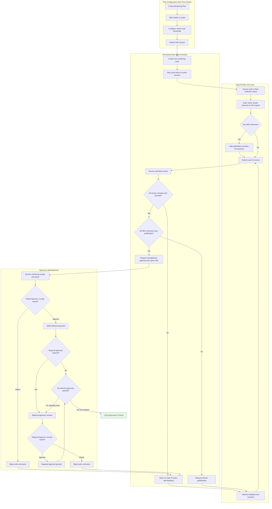
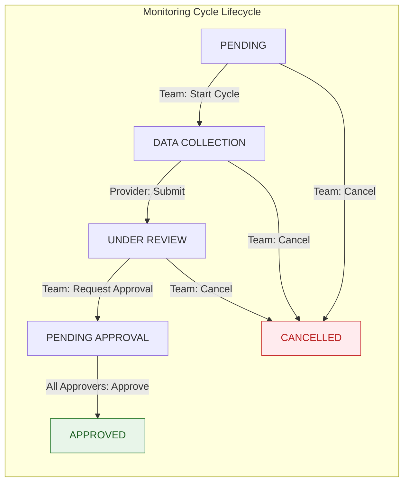
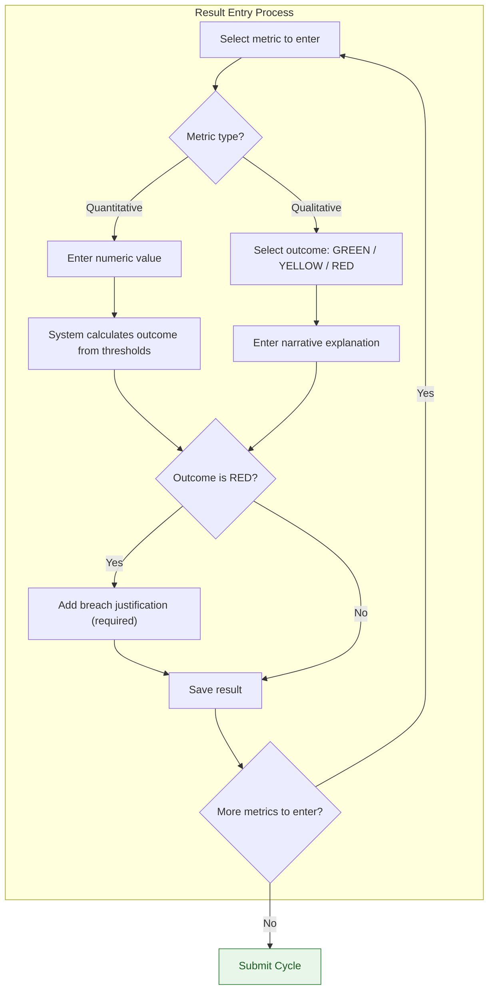
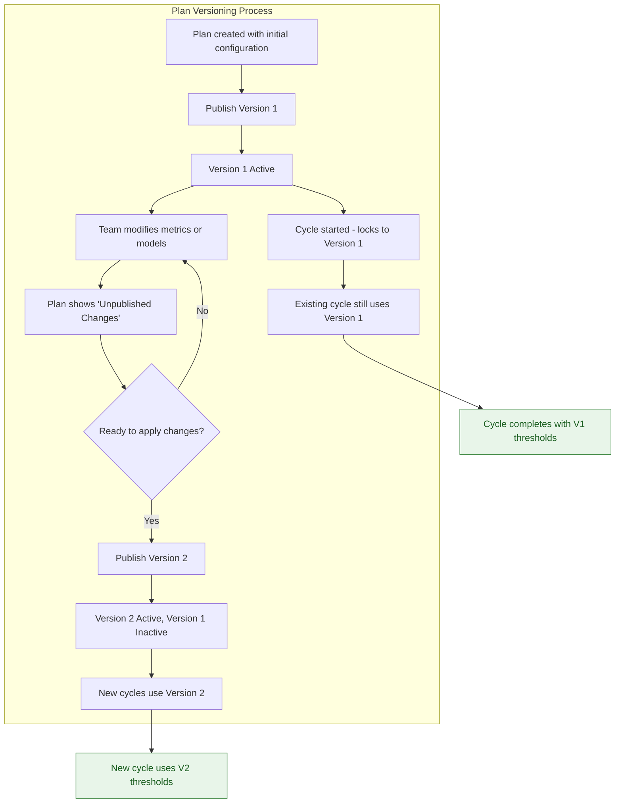
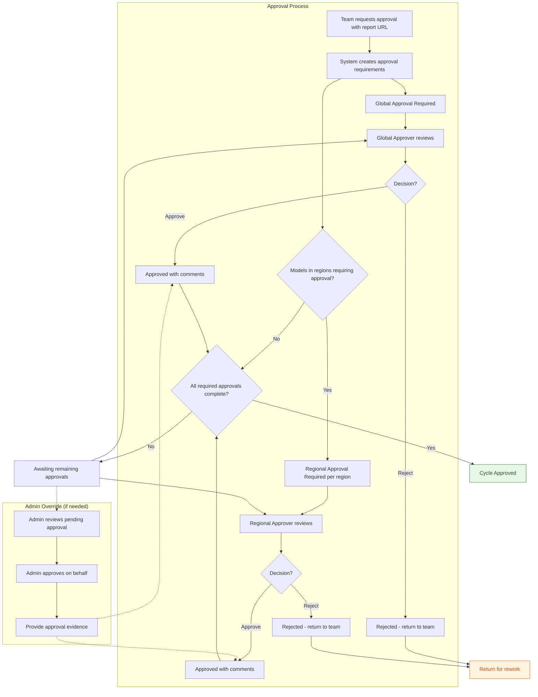
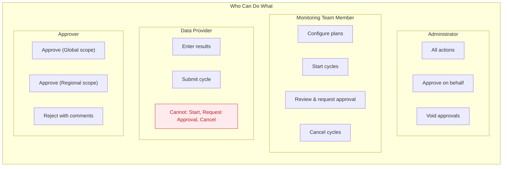
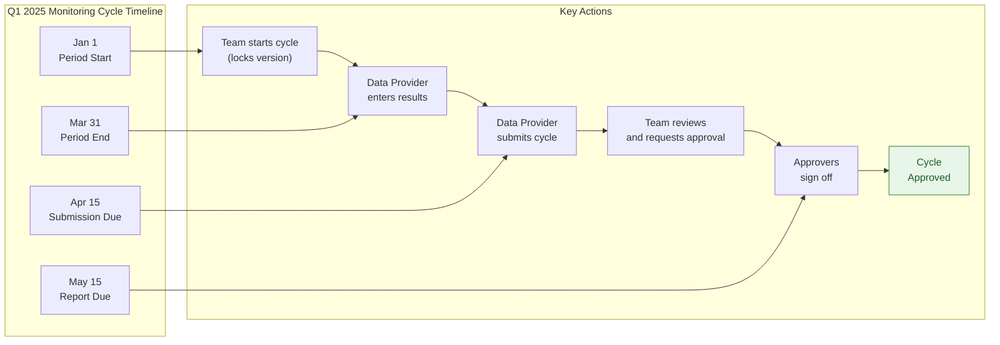

# Performance Monitoring Business Process Flow

## Complete Monitoring Cycle Workflow

---

## Simplified Cycle Status Flow

---

## Data Entry Decision Flow

---

## Plan Version Management Flow

---

## Approval Workflow Detail

---

## Role Permissions Summary

---

## End-to-End Timeline Example

